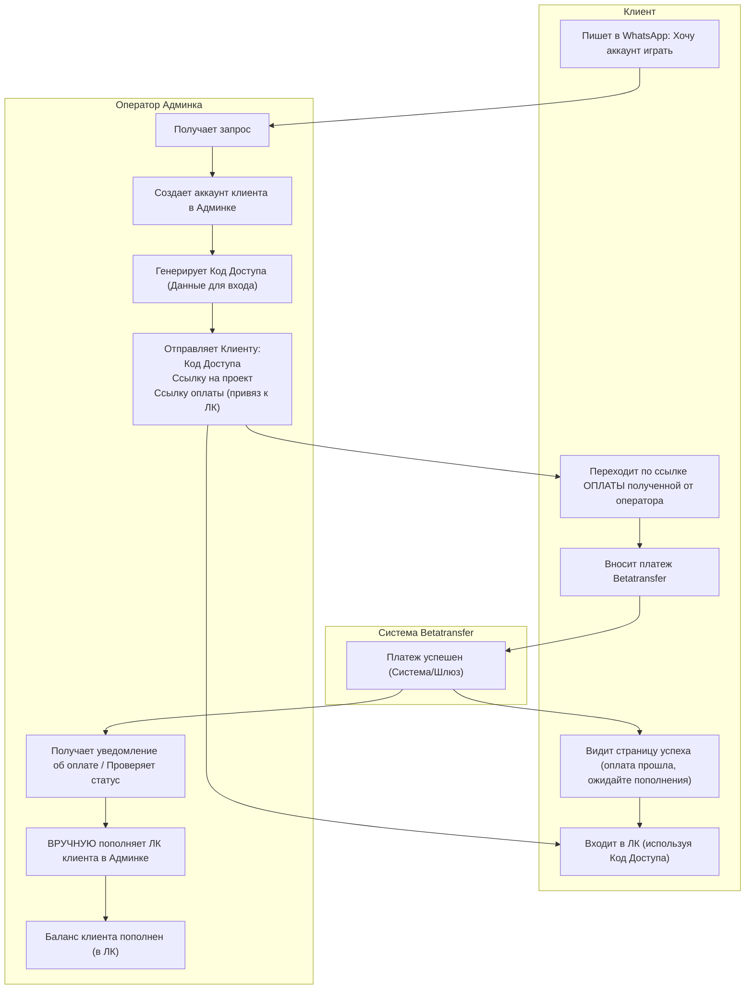

```mermaid
 graph TD
    subgraph "Клиент"
        A["Пишет в WhatsApp: Хочу аккаунт играть"]
        F["Переходит по ссылке ОПЛАТЫ полученной от оператора"]
        G["Вносит платеж Betatransfer"]
        %% Шаг 5 - клиент видит страницу успеха
        J["Видит страницу успеха (оплата прошла, ожидайте пополнения)"]
        I["Входит в ЛК (используя Код Доступа)"]
    end
    subgraph "Оператор Админка"
        B["Получает запрос"]
        C["Создает аккаунт клиента в Админке"]
        D["Генерирует Код Доступа (Данные для входа)"]
        %% Отправка данных клиенту с переносами строк
        E["Отправляет Клиенту:<br/>Код Доступа<br/>Ссылку на проект<br/>Ссылку оплаты (привяз к ЛК)"]
        %% Шаг 6 - начало: Оператор уведомлен/проверяет
        H_notify["Получает уведомление об оплате / Проверяет статус"]
        %% Шаг 6 - действие: Оператор вручную пополняет
        K["ВРУЧНУЮ пополняет ЛК клиента в Админке"]
        %% Результат ручного пополнения
        L["Баланс клиента пополнен (в ЛК)"]
    end
    subgraph "Система Betatransfer"
        %% Результат шага 4: Платеж успешен
        H_confirm["Платеж успешен (Система/Шлюз)"]
    end

    %% ----- Связи между узлами -----

    %% Основной Поток
    %% Запрос от клиента
    A --> B;
    %% Создание аккаунта
    B --> C;
    %% Генерация кода доступа
    C --> D;
    %% Отправка данных клиенту
    D --> E;
    %% Клиент переходит по ссылке оплаты
    E --> F;
    %% Клиент платит
    F --> G;
    %% Платежная система подтверждает успех
    G --> H_confirm;

    %% Ветвление после подтверждения платежа
    %% Клиент видит страницу успеха
    H_confirm --> J;
    %% Оператор получает уведомление / видит статус
    H_confirm --> H_notify;

    %% Действия оператора
    %% Оператор вручную пополняет счет
    H_notify --> K;
    %% Результат - баланс пополнен
    K --> L;

    %% Вход клиента (может быть в разное время)
    %% Возможность входа сразу после получения данных
    E --> I;
    %% Возможность входа после страницы успеха
    J --> I;
    %% Подразумевается, что клиент увидит баланс (L) при входе (I) только после шага K
```
