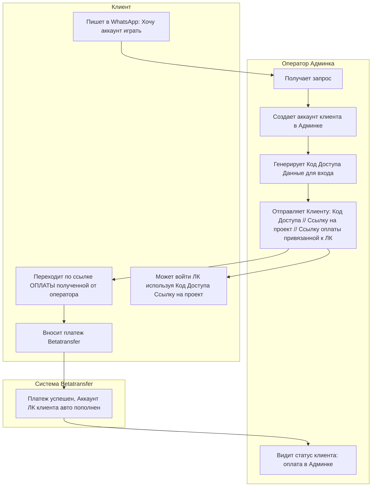

```mermaid
 graph TD
    subgraph "Клиент"
        %% Узлы Клиента
        A[" Пишет в WhatsApp: Хочу аккаунт играть"]
        F[" Переходит по ссылке ОПЛАТЫ полученной от оператора"]
        G[" Вносит платеж Betatransfer"]
        I["Может войти ЛК используя Код Доступа Ссылку на проект"]
    end
    subgraph "Оператор Админка"
         %% Узлы Оператора
        B[" Получает запрос"]
        C["Создает аккаунт клиента в Админке"]
        D[" Генерирует Код Доступа Данные для входа"]
        E[" Отправляет Клиенту: Код Доступа // Ссылку на проект // Ссылку оплаты привязанной к ЛК"]
        K[" Видит статус клиента: оплата в Админке"]
    end
    subgraph "Система Betatransfer"
         %% Узлы Системы
         H[" Платеж успешен, Аккаунт ЛК клиента авто пополнен"]
    end

    %% Связи
    A --> B;
    B --> C;
    C --> D;
    D --> E;
    E --> F;
    F --> G;
    G --> H;
    H --> K;
    E --> I;
```
