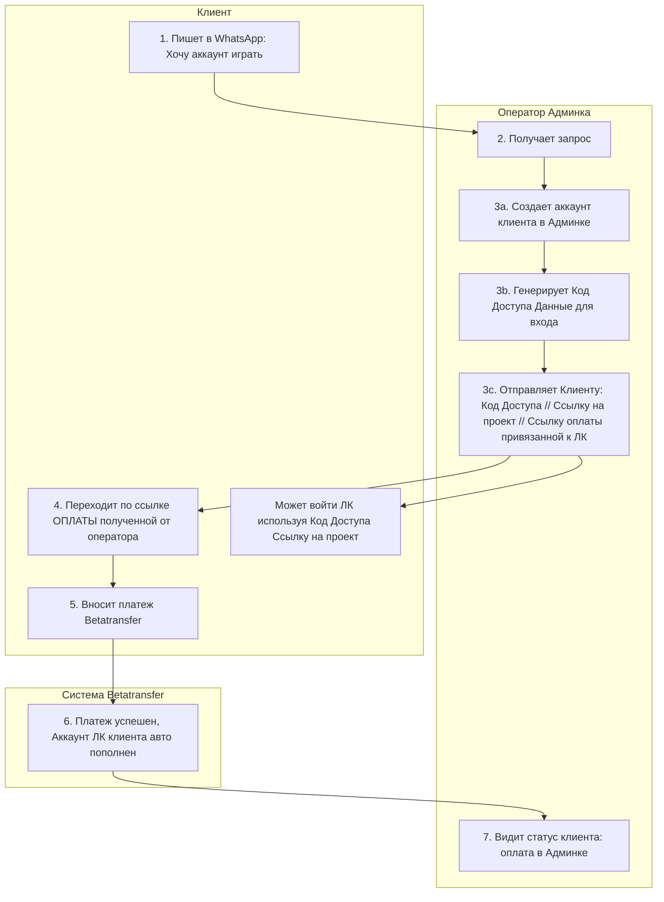

```mermaid
 graph TD
    subgraph "Клиент"
        %% Узлы Клиента
        A["1. Пишет в WhatsApp: Хочу аккаунт играть"]
        F["4. Переходит по ссылке ОПЛАТЫ полученной от оператора"]
        G["5. Вносит платеж Betatransfer"]
        I["Может войти ЛК используя Код Доступа Ссылку на проект"]
    end
    subgraph "Оператор Админка"
         %% Узлы Оператора
        B["2. Получает запрос"]
        C["3a. Создает аккаунт клиента в Админке"]
        D["3b. Генерирует Код Доступа Данные для входа"]
        E["3c. Отправляет Клиенту: Код Доступа // Ссылку на проект // Ссылку оплаты привязанной к ЛК"]
        K["7. Видит статус клиента: оплата в Админке"]
    end
    subgraph "Система Betatransfer"
         %% Узлы Системы
         H["6. Платеж успешен, Аккаунт ЛК клиента авто пополнен"]
    end

    %% Связи
    A --> B;
    B --> C;
    C --> D;
    D --> E;
    E --> F;
    F --> G;
    G --> H;
    H --> K;
    E --> I;
```
